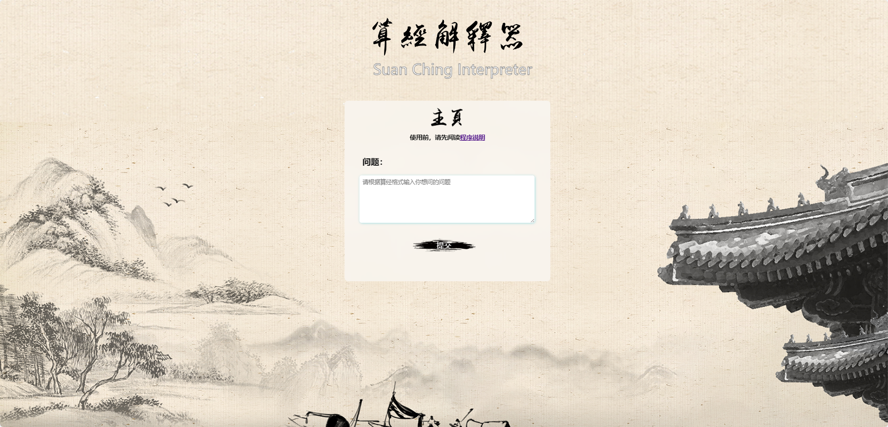
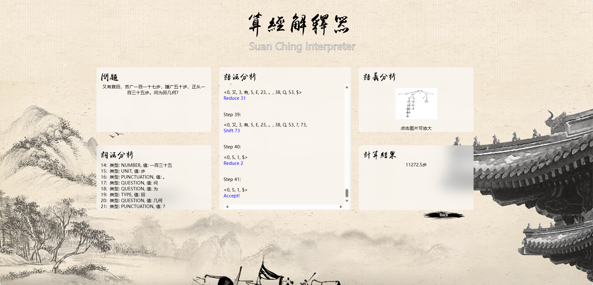

# The-Nine-Chapters-Analyzer
The project has compiler function, which can compile and calculate the results of nine chapters of arithmetic expressions entered by users to achieve automatic calculation.




# [Deployed URL, please try](https://flask-4h7a-125485-8-1330674985.sh.run.tcloudbase.com/user/homepage)

### Option 1: Install Python Dependencies (Using `requirements.txt`)

To install all Python dependencies, simply use the provided `requirements.txt` file. You can install them with the following command:

```bash
pip install -r requirements.txt
```

### Alternatively, you can manually install them using the following command:

```py
pip install flask==3.0.1 flask-ext=0.1 flask-session 0.7.0 werkzeug==3.0.1 pyautogui openpyxl
```

### How to use:
1. Install all python dependencies
2. Run the file "**main.py**"
3. Automatically open web page "http://127.0.0.1:8080/user/homepage"

### Document explanation:
1. Root directory: <br>
"Main.py" is the main program file; <br>
"readme.md" is the program description (this file) <br>
The "app" file contains all the subfiles. <br>
3. In the "app" folder: <br>
"controller" stores all the control files including lexer, parser, user <br>
"templates" stores all user interface programs (html css) <br>
"static" stores all static libraries, i.e. page backgrounds, etc. <br>

### Option 2: Deploy Using Docker
If you prefer to deploy the application using Docker, follow these instructions:

Create Dockerfile:
A Dockerfile has already been provided in the project. Here¡¯s what it does:

Installs Python 3.11 and all required dependencies.
Installs SimHei font for Chinese character support.
Copies the application files into the Docker container.
Exposes port 8080 for the Flask application.

You can build the Docker image using the following command:
```bash
docker build -t nine-chapters-analyzer .
```
Run the Docker Container:
After building the Docker image, you can run the container with the following command:
```bash
docker run -d -p 8080:8080 nine-chapters-analyzer
```
This will start the Flask web application and bind it to port 8080.
Access the Application:
Once the Docker container is running, you can access the web application at:
http://<your-server-ip>:8080/user/homepage

Note:
The application is pre-configured to run on port 8080. Ensure that this port is available on your server or modify the Dockerfile and app.run() command to use a different port if necessary.
Make sure your server or local machine has Docker installed and running before building and deploying with Docker.

### 如何使用:
1. 安装所有python�赖�
2. �行文件"**main.py**"
3. 自动打开网页"http://127.0.0.1:8080/user/homepage"

### 文件解释:
1. 根目�: <br>
    "main.py" 是程�主文件�<br>
    "readme.md" 是程�说�（本文件） <br>
    "app"文件里包�了所有�文件. <br>
3. �"app"文件夹中: <br>
    "controller" 存储了所有�制文件包�lexer, parser, user <br>
    "templates" 存储了所有用户界�程�（html css�<br>
    "static" 存储了所有��资�库，�网页背景� <br>


### THE END. Thanks for reading this instruction.
